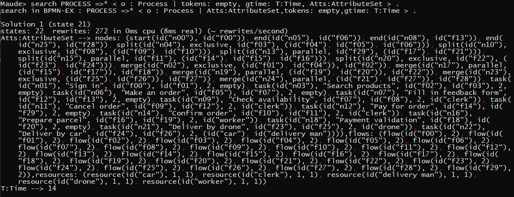
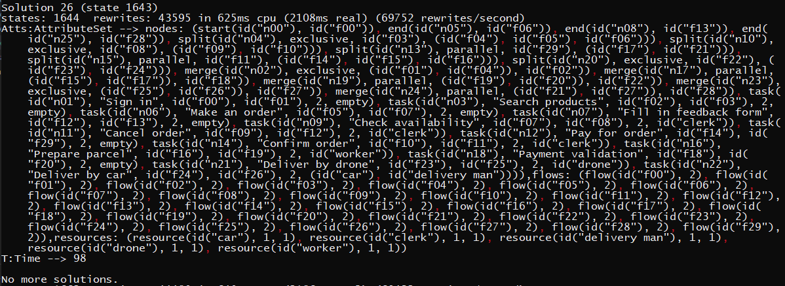

## 2.1. Utiliza el comando search para buscar estados del proceso a lo largo de su ejecución limitada a 100 unidades de tiempo en que no haya ningún token en el conjunto del atributo tokens. Explica el resultado.





`search PROCESS =>* < o : Process | tokens: empty, gtime: T:Time, Atts:AttributeSet >`

Para esta primera búsqueda se ha realizado un `search` con resultado un proceso tal que el conjunto de tokens esté vacío, es decir, se haya llegado a algún nodo de tipo `end`. Para limitar la búsqueda y hacerla finita, ya que debido a la regla `[tick]` la ejecución es infinita porque el tiempo siempre va incrementándose, se le ha añadido una restricción a la propia regla en la que el tiempo resultante tiene que ser menor a 100 unidades de tiempo.

Como se puede observar, se encuentran 26 resultados, debido a que la tarea "Search products" está dentro en un bucle, haciendo que haya diversos estados de salida aunque sólo se encuentren tres nodos finales. Sin embargo, dentro de estos 26 resultados obtenidos se pueden encontrar caminos a todos estos nodos finales observando los resultados y haciendo uso de los comandos `show path` y `show path labels`.

Ejemplo de las salidas correspondientes, limitando el bucle inicial para que solo se muestre 1 vez e indicando el nombre de cada tarea:

- Finalización en nodo final `"n05"` - estado 21

```
Maude> show path labels 21 .
start
tick
enter-task ("Sign in")
tick
exit-task
tick
merge-exclusive (inicio del bucle - 1 iteracion)
tick
enter-task ("Search products")
tick
exit-task
tick
split-exclusive (fin del bucle)
tick
end
```

- Finalización en nodo final `"n08"` - estado 1366

```
Maude> show path labels 1366 .
start
tick
enter-task ("Sign in")
tick
exit-task
tick
merge-exclusive (inicio del bucle - 8 iteraciones)
tick
enter-task ("Search products")
tick
exit-task
tick
split-exclusive (fin del bucle)
tick
enter-task ("Make an order")
tick
exit-task
tick
enter-task ("Check availability")
tick
exit-task
tick
split-exclusive
tick
enter-task ("Cancel order")
tick
exit-task
tick
enter-task ("Fill in feedback form")
tick
exit-task
tick
end
```

- Finalización en nodo final `"n25"` - estado 1643

```
Maude> show path labels 1643 .
start
tick
enter-task ("Sign in")
tick
exit-task
tick
merge-exclusive (inicio del bucle - 6 iteraciones)
tick
enter-task ("Search products")
tick
exit-task
tick
split-exclusive (fin del bucle)
tick
enter-task ("Make an order")
tick
exit-task
tick
enter-task ("Check availability")
tick
exit-task
tick
split-exclusive
tick
enter-task ("Confirm order")
tick
exit-task
tick
split-parallel
tick
enter-task ("Pay for order")
tick
enter-task ("Prepare parcel")
tick
exit-task
tick
exit-task
tick
split-parallel
tick
merge-parallel
tick
enter-task ("Payment validation")
tick
exit-task
tick
merge-parallel
tick
split-exclusive
tick
enter-task ("Deliver by drone")
tick
exit-task
tick
merge-exclusive
tick
merge-parallel
tick
end
```